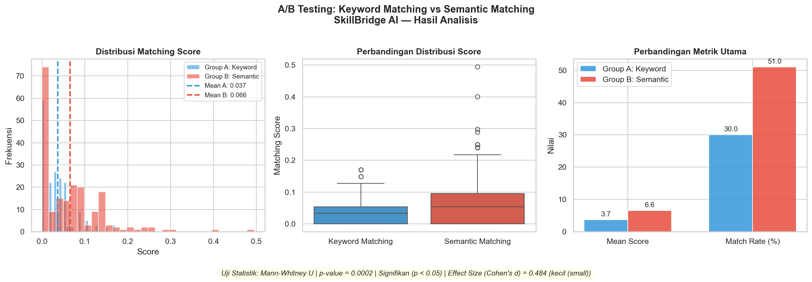

# SkillBridge AI — Data Science

---

## Daftar Isi

1. [Problem Discovery](#1-problem-discovery)
2. [Pertanyaan Bisnis](#2-pertanyaan-bisnis)
3. [Data Wrangling](#3-data-wrangling)
4. [Exploratory Data Analysis](#4-exploratory-data-analysis-eda)
5. [Visualisasi & Explanatory Analysis](#5-visualisasi--explanatory-analysis)
6. [Persiapan Data untuk Modeling](#6-persiapan-data-untuk-modeling)
7. [Dashboard Streamlit](#7-dashboard-streamlit)
8. [A/B Testing](#8-ab-testing)
9. [Laporan Teknis](#9-laporan-teknis)
10. [Struktur Proyek](#10-struktur-proyek)
11. [Cara Menjalankan](#11-cara-menjalankan)

---

## 1. Problem Discovery

### Permasalahan
Banyak pencari kerja di Indonesia kesulitan mengetahui jabatan mana yang paling cocok dengan skill yang mereka miliki. Di sisi lain, standar kompetensi resmi (SKKNI) belum tentu selaras dengan kebutuhan industri nyata saat ini, sehingga pelamar sulit mengukur kesiapan mereka secara objektif.

### Solusi Utama
Membangun sistem rekomendasi pekerjaan berbasis AI (**SkillBridge AI**) yang:
- Menerima CV pelamar melalui upload file
- Menganalisis dan mengekstrak skill dari CV
- Mencocokkan skill dengan standar kompetensi SKKNI
- Merekomendasikan jabatan yang paling relevan dengan profil pelamar

---

## 2. Pertanyaan Bisnis

Pertanyaan bisnis didefinisikan secara terukur untuk memandu seluruh proses analisis:

| Pertanyaan Bisnis | Dataset | Metrik |
|---|---|---|---|
| Berapa jumlah unit kompetensi masing-masing jabatan di SKKNI? Job mana yang paling kompleks? | SKKNI | Jumlah unit kompetensi unik per jabatan |
| Skill apa yang paling sering diminta perusahaan di Indonesia saat ini? | JobStreet Indonesia | Frekuensi kemunculan skill di lowongan kerja |
| Seberapa besar kesenjangan antara kompetensi standar SKKNI dengan kebutuhan industri nyata? | Gabungan | % skill SKKNI yang relevan dengan industri |

---

## 3. Data Wrangling

### 3.1 Gathering Data

Data dikumpulkan dari berbagai sumber, **tidak menggunakan dataset siap pakai tanpa proses cleaning manual**:

| Dataset | Sumber | Metode Pengumpulan | File |
|---|---|---|---|
| SKKNI | Website resmi SKKNI | Web scraping manual | `5_data_pekerjaan.csv` |
| Lowongan Kerja Indonesia | JobStreet via GitHub | Download dataset publik + filter manual | `cleaned_job_5.csv` |
| Data Training Model | Kaggle | Download dataset publik + cleaning manual | `training dataset` |

### 3.2 Assessing Data

Evaluasi kualitas dan struktur data dilakukan pada setiap dataset:

**SKKNI:**
- Total baris awal: lebih dari 1.000 baris (sebelum filter)
- Ditemukan: jabatan yang terlalu beragam, perlu difokuskan
- Ditemukan: beberapa baris duplikat pada unit kompetensi

**Lowongan Kerja:**
- Total baris awal: lebih dari 5.000 baris
- Ditemukan: banyak kolom dengan nilai `none` / kosong
- Ditemukan: format requirement tidak konsisten (koma, titik koma, newline)
- Ditemukan: jabatan yang tidak relevan dengan 5 target jabatan

**Data Training:**
- Ditemukan: kolom skill dalam format string list yang perlu di-parse
- Ditemukan: noise karakter khusus pada teks
- Ditemukan: potensi data leakage pada kolom target

### 3.3 Cleaning Data

Seluruh proses cleaning dilakukan **secara manual** tanpa menggunakan dataset yang sudah siap pakai:

**SKKNI (`5_data_pekerjaan.csv`) — hasil akhir: 321 baris**
- Filter 5 jabatan terbanyak: Cyber Security, Programmer, Data Analyst, Insinyur Elektro, Teknisi Akuntansi
- Normalisasi nama jabatan dan judul unit kompetensi
- Hapus baris duplikat
- Standarisasi format teks (strip whitespace, title case)

**Lowongan Kerja (`cleaned_job_5.csv`) — hasil akhir: 2.516 baris**
- Filter lowongan yang relevan dengan 5 jabatan target
- Bersihkan kolom `requirement` dari karakter khusus dan noise
- Normalisasi nilai kolom `type_of_work` dan satuan pengalaman kerja
- Hapus baris dengan requirement kosong / tidak informatif

**Data Training (`training dataset.csv`)**
- Parse kolom skill dari format string list ke list Python
- Normalisasi teks: lowercase, strip whitespace, hapus karakter non-alfabet
- Hapus duplikat dan data tidak relevan
- **Pastikan tidak ada data leakage**: kolom target dipisah dari fitur training

---

## 4. Exploratory Data Analysis (EDA)

EDA dilakukan pada kedua dataset utama untuk mendapatkan insight sebelum analisis lebih lanjut. **Setiap analisis disertai penjelasan dalam bentuk markdown/teks.**

### Insight Dataset SKKNI
- Programmer memiliki unit kompetensi terbanyak → jabatan paling kompleks
- Teknisi Akuntansi memiliki unit kompetensi paling sedikit
- Total 321 baris, 5 jabatan, dengan variasi jumlah elemen kompetensi yang signifikan antar jabatan

### Insight Dataset Lowongan Kerja
- 2.516 lowongan dari berbagai perusahaan di Indonesia
- Mayoritas lowongan bersifat full-time
- Skill komunikasi, manajemen, dan teknis mendominasi kolom requirement
- Rata-rata pengalaman yang dibutuhkan: 1–3 tahun

> Seluruh insight di atas didukung oleh visualisasi data. **Tidak ada kesimpulan yang ditarik tanpa visualisasi pendukung.**

---

## 5. Visualisasi & Explanatory Analysis

Visualisasi dibuat untuk menjawab 3 pertanyaan bisnis yang telah didefinisikan:

### Kompleksitas Jabatan SKKNI
Bar chart horizontal jumlah unit kompetensi unik per jabatan.
Menjawab: jabatan mana yang memiliki standar kompetensi paling kompleks.

### Skill Demand Industri
- Bar chart top N skill paling sering diminta di lowongan kerja Indonesia
- Pie chart distribusi tipe pekerjaan (full-time, freelance, dll)
- Metrik rata-rata minimum dan maksimum pengalaman kerja yang dibutuhkan

### Gap Analysis SKKNI vs Industri
- Bar chart persentase relevansi skill SKKNI terhadap kebutuhan industri per jabatan
- Tabel detail skill SKKNI yang tidak ditemukan di pasar kerja
- Kode warna merah/hijau berdasarkan threshold relevansi 50%

---

## 6. Persiapan Data untuk Modeling

### Data Dictionary

**`5_data_pekerjaan.csv`** — 321 baris, 5 kolom

| Kolom | Tipe Data | Keterangan |
|---|---|---|
| `Jabatan` | string | Nama jabatan (5 jabatan target) |
| `Kode Unit` | string | Kode unit kompetensi SKKNI |
| `Judul Unit` | string | Judul unit kompetensi |
| `Elemen Kompetensi` | string | Elemen dalam unit kompetensi |
| `KUK` | string | Kriteria Unjuk Kerja |

**`cleaned_job_5.csv`** — 2.516 baris, 18 kolom

| Kolom | Tipe Data | Keterangan |
|---|---|---|
| `title` | string | Judul/posisi pekerjaan |
| `company` | string | Nama perusahaan |
| `location` | string | Lokasi pekerjaan |
| `type_of_work` | string | Tipe pekerjaan (full-time, freelance, dll) |
| `requirement` | string | Skill dan kualifikasi yang dibutuhkan (**fitur utama**) |
| `description` | string | Deskripsi pekerjaan |
| `min_work_experience` | float | Minimum pengalaman kerja (tahun) |
| `max_work_experience` | float | Maksimum pengalaman kerja (tahun) |
| `min_salary` | float | Gaji minimum |
| `max_salary` | float | Gaji maksimum |
| `currency` | string | Mata uang (IDR, SGD, dll) |
| `job_level` | string | Level jabatan |
| `link` | string | URL lowongan |

### Feature Engineering
- Ekstraksi skill dari teks requirement menggunakan regex dan tokenisasi
- TF-IDF vectorization (max 500 fitur, unigram + bigram) untuk representasi teks
- Normalisasi skor matching ke rentang 0–1
- Pembuatan fitur overlap skill antara CV dan profil jabatan SKKNI
- Penghapusan stop words bahasa Indonesia dan Inggris

### Checklist Kesiapan Data Modeling
- Tidak ada data leakage (kolom target dipisah dari fitur training)
- Format dataset final bersih dan siap digunakan model
- Missing values sudah ditangani
- Tipe data sudah sesuai untuk pemrosesan model
- Tidak ada dataset yang digunakan tanpa proses cleaning manual

---

## 7. Dashboard Streamlit

Dashboard interaktif untuk menampilkan insight dan kesimpulan dari seluruh analisis data.

### Halaman Dashboard

| Halaman | Konten | Dataset |
|---|---|---|
| Overview Jabatan | Tabel + bar chart semua jabatan SKKNI | SKKNI |
| Unit Kompetensi | Bar chart kompleksitas jabatan + tabel detail unit | SKKNI |
| Skill Demand | Top N skill industri + pie chart tipe pekerjaan + metrik pengalaman | JobStreet |
| Gap Analysis | % relevansi per jabatan + tabel skill yang gap | Gabungan |

### Fitur Interaktif
- Filter jabatan melalui dropdown sidebar
- Slider jumlah top skill yang ditampilkan
- Metric cards ringkasan (jumlah jabatan, total baris, total lowongan, % relevansi)
- Auto-refresh setiap 60 detik

### Deployment
Dashboard sudah di-deploy ke Streamlit Cloud dan dapat diakses secara publik:

link : https://latihan-mutand2svg2mzyvqypsmgc.streamlit.app/

### Cara Menjalankan Lokal
```bash
pip install streamlit streamlit-autorefresh pandas matplotlib seaborn
streamlit run dashboard.py
```

---

## 8. A/B Testing

Eksperimen untuk membuktikan secara statistik metode matching mana yang lebih akurat dalam mencocokkan CV pelamar dengan jabatan yang tersedia.

### Desain Eksperimen

| | Group A | Group B |
|---|---|---|
| **Metode** | Keyword Matching | Semantic Matching (TF-IDF) |
| **Cara kerja** | Overlap kata kunci CV vs profil SKKNI | Cosine similarity TF-IDF |
| **Sampel** | 200 CV simulasi | 200 CV simulasi |

### Hasil

| Metrik | Group A (Keyword) | Group B (Semantic) |
|---|---|---|
| Mean Score | 0.0371 | **0.0656** |
| Match Rate | 30.0% | **51.0%** |
| Peningkatan | — | **+77%** |
| p-value | — | **0.000194** |
| Effect Size (Cohen's d) | — | 0.4842 (medium) |


### Kesimpulan
Tolak H0. Semantic Matching secara statistik **lebih baik** dari Keyword Matching (p = 0.000194 < α = 0.05). **Semantic Matching direkomendasikan sebagai metode utama SkillBridge AI.**

### Cara Menjalankan
```bash
python AB_Testing/ab_testing.py
```

---

## 9. Laporan Teknis

Laporan teknis komprehensif mencakup seluruh tahapan proyek mulai dari Problem Discovery hingga hasil akhir, tersedia dalam format PDF.

**`belum ada, nanti kami isi`**

Isi laporan mencakup:
- Problem Discovery & definisi solusi
- Pertanyaan bisnis yang terukur
- Proses Data Wrangling end-to-end
- Hasil EDA + visualisasi
- Explanatory analysis per pertanyaan bisnis
- Persiapan data untuk modeling & feature engineering
- Hasil A/B Testing + interpretasi statistik
- Kesimpulan & rekomendasi

---

## 10. Struktur Proyek

```
capstone_project/
│
├── data_skkni/
│   ├── 5_data_pekerjaan.csv           # Dataset SKKNI (321 baris, 5 jabatan)
│   ├── cleaned_job_5.csv              # Dataset lowongan kerja Indonesia (2.516 baris)
|   └── data_pekerjaan                 # Dataset skkni (sudah di-cleaning)
│
├── dashboard/
│   └── dashboard.py                   # Dashboard Streamlit (4 halaman)
│
├── AB_Testing/
│   ├── ab_testing.py                  # Script A/B Testing Python
│   ├── AB_testing.png                 # Visualisasi hasil eksperimen
│   └── README.md                      # Dokumentasi A/B Testing
|
|── data_training
|   └── dataset training               # Dataset training model (sudah di-cleaning)
│
├── laporan/
│   └── Laporan_Teknis_SkillBridge_AI.pdf  # Laporan teknis PDF
│
├── requirements.txt                   # Dependensi Python
└── README.md                          # Dokumentasi utama (file ini)
```

---

## 11. Cara Menjalankan

### Install semua dependensi
```bash
pip install -r requirements.txt
```

### Jalankan Dashboard
```bash
streamlit run dashboard/dashboard.py
```

### Jalankan A/B Testing
```bash
python AB_Testing/ab_testing.py
```

### Isi `requirements.txt`
```
streamlit
streamlit-autorefresh
pandas
numpy
matplotlib
seaborn
scikit-learn
scipy
```

---

## Tim Data Science

Proyek ini dikembangkan sebagai bagian dari **Capstone Project — SkillBridge AI**.
